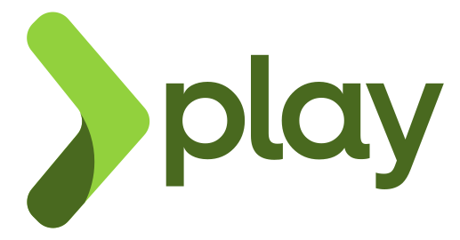

% Programmer's Learning Machine
% Matthieu Nicolas
% IJD seminar - March 03, 2015

# What is PLM

> - Software to learn programming
> - Allows students to progress at their own speed...
> - ... while the teacher helps the ones having trouble
> - Used at *TELECOM Nancy* since 2008 

# Current state

------

## Overview { data-transition="none" }

------

## Overview { data-transition="none" }

------

## Overview { data-transition="none" }

------

## 200 exercises { data-transition="none" }

------

## 200 exercises { data-transition="none" }

------

## 200 exercises { data-transition="none" }

------

## Programming languages

------

## Languages

# ADT's goals

------

## Improve the software's quality

	- Fix known bugs
	- Set up Continuous Integration
	- More features

------

## Attract students

- More teaching content
- More user-friendly
- Gamification

------

## And teachers

- Keep track of the students' progress
- Adapt content to their needs
- Able to add their own exercises

------

## And researchers

- To an experimental teaching platform
- How to detect students having difficulties?
- What are the most common errors?

# Work done

------

## First steps

- Back-to-school season
	- Got the students' feedback...
	- ... and 170 bug reports
- Solved minor issues

------

## User tracking { data-transition="none" }

- **git** as a database management system

------

## User tracking { data-transition="none" }

- User's actions stored as commits

<pre><code data-trim>{ 
	kind:"executed",
	lang:"Java",
	exo:"welcome.lessons.welcome.instructions.Instructions", 
	passedtests:"1",
	totaltests:"1",
	outcome:"pass"
}</code></pre>

------

## User tracking { data-transition="none" }

- Data pushed anonymously to a **GitHub** repository...
- ... but lost some tracks
- Fixed and refactored the code

------

## Unit testing

- Need to ensure the critical parts
	- **git**
	- exercises' solutions
	- lessons

------

## Continuous Integration { data-transition="none" }

- Execute tests automatically
	- when push to *master*
	- or a pull-request is created

------

## Continuous Integration { data-transition="none" }

- Execute tests automatically when
	- someone push to *master*
	- a pull-request is created
- Notify us when the build state change
<!--

- Easily configurable:

<pre><code data-trim>language: scala
scala:
  - 2.10.5
jdk:
  - openjdk7
env:
  - TEST_SUITE=unit-tests
  - TEST_SUITE=integration-tests
script:
  - ant $TEST_SUITE
notifications:
  recipients:
    - martin.quinson@loria.fr
    - gerald.oster@loria.fr
    - matthieu.nicolas@loria.fr
  email:
    on_success: change
    on_failure: always
  template:
    - "%{repository}/%{branch} (%{commit} - %{author}): %{message}"</code></pre>
-->

------

## To a web app

------

## Server-side { data-transition="none" }

- Refactoring **PLM** into a library
- Set up a server using **Play framework**

------

## Client-side { data-transition="none" }

- Built with **AngularJS** and **Foundation**
- Dialog with the server using **Websockets**

------

## Client-side { data-transition="none" }

- **TODO:** Video instead?

# Results

- Main functionalities implemented
- First universe adapted
- Only as a local server

# Next steps

- Set up the **CI** for **webPLM**
- Convert other universes
- Add debug mode
- Add **C** language

------

## Thanks for listening

Do you have any questions?

